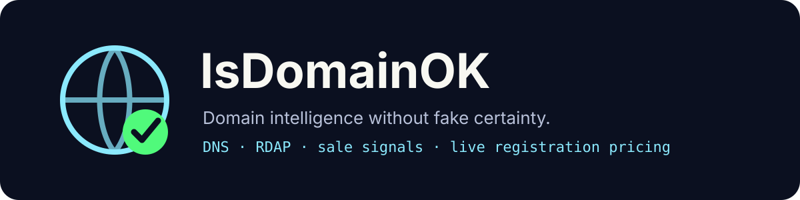

<p align="center">
  
</p>

<p align="center">
  
  
  
  
</p>

# IsDomainOK

**A small domain-intelligence CLI for humans, scripts and AI agents.**

IsDomainOK checks more than “does DNS resolve?”. It combines DNS evidence with authoritative RDAP registration data, can inspect public landing pages for domain-sale signals, and can optionally request a live registrar quote for an available domain.

> Version 2 is the successor to `okitsok`. The old `okitsok` command remains available as a compatibility alias.

## Why

A domain with no DNS records is **not automatically available**. IsDomainOK therefore treats DNS as a fast signal and RDAP as the stronger registration source when the TLD supports it.

## Features

- DNS checks: NS, SOA, A and AAAA
- RDAP lookup using the IANA bootstrap registry
- registration metadata: registrar, registration date, expiration date and nameservers when public
- multiple names and custom TLDs in one call
- parallel checks
- conservative sale-page detection for registered domains
- public asking-price extraction when a sale page clearly exposes a price
- optional one-year GoDaddy registration quote with `GODADDY_PAT`
- stable JSON output for automation and agents
- no database, account or hosted backend required

## Install

The v2 package is not claimed as published on PyPI yet. For now install it from a clone:

```bash
git clone https://github.com/coconut971/okitsok.git
cd okitsok
python -m pip install -e .
```

Once the package is published, the intended install command will be:

```bash
pipx install isdomainok
```

## Quick start

```bash
isdomainok lightsraw
```

Default TLDs are `.com`, `.fr`, `.io`, `.ai` and `.app`.

Check exact domains:

```bash
isdomainok example.com example.net
```

Choose TLDs:

```bash
isdomainok lightsraw --tlds com fr ai dev tech
```

Machine-readable output:

```bash
isdomainok lightsraw --json
```

Inspect public sale pages:

```bash
isdomainok example.com --market
```

If a public landing page clearly says the domain is for sale, IsDomainOK reports the marketplace when recognizable. If a clear buy-now or asking price is present, it reports that too. **No price is invented when the page does not expose one.**

## Live registration pricing

Registration prices depend on the registrar, TLD, promotions and time. IsDomainOK can request a live GoDaddy one-year registration quote when you provide a GoDaddy Personal Access Token:

```bash
export GODADDY_PAT="..."
isdomainok mynewname.com --price
```

`--price` only requests availability and a quote. It does **not** purchase or register a domain.

## Output model

Statuses:

- `registered` — RDAP or DNS provides positive evidence that the domain is registered/in use
- `available` — authoritative RDAP indicates that the domain is not registered
- `possibly_available` — DNS returned NXDOMAIN but RDAP could not confirm availability
- `unknown` — the tool could not make a reliable determination

Example JSON shape:

```json
[
  {
    "domain": "example.com",
    "status": "registered",
    "dns_status": "taken",
    "rdap_status": "registered",
    "registrar": "Example Registrar",
    "registered_at": "1995-08-14T04:00:00Z",
    "expires_at": "2027-08-13T04:00:00Z",
    "nameservers": ["a.iana-servers.net", "b.iana-servers.net"],
    "for_sale": false,
    "marketplace": null,
    "asking_price": null,
    "registration_price": null,
    "sale_url": "https://example.com/",
    "notes": []
  }
]
```

## Price limitations

There are two very different prices:

1. **Registration price** for an unregistered domain — registrar-specific and obtainable through supported registrar APIs.
2. **Resale/asking price** for a registered domain — only knowable when the owner or marketplace publishes it, or when a broker provides it.

IsDomainOK intentionally returns “price unavailable” rather than estimating a resale value from made-up heuristics. When a registered domain appears to be for sale without a public price, the practical next step is to contact the marketplace, registrar, owner or a domain broker.

## Privacy and network requests

Depending on flags, IsDomainOK may contact:

- DNS resolvers configured on the machine
- IANA's RDAP bootstrap registry and authoritative RDAP services
- the target domain itself when `--market` is enabled
- GoDaddy's Domains API when `--price` is enabled

No telemetry is sent by IsDomainOK itself.

## Compatibility

The Python package internals remain under `okitsok` for the 2.0 transition. Both commands work:

```bash
isdomainok example
okitsok example
```

## Development

Run the test suite:

```bash
python -m unittest discover -s tests -v
```

CI runs on Python 3.9, 3.11 and 3.13.

## License

MIT
